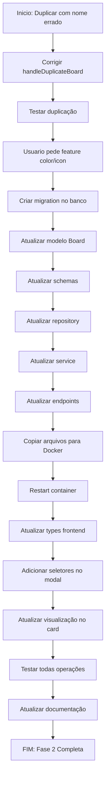

# 📝 Resumo da Sessão - 13/01/2026

**Data:** 13/01/2026 - Segunda-feira
**Duração:** ~3 horas
**Foco:** Frontend - Fase 2 (Boards) + Feature de Personalização Visual

---

## 🎯 Objetivo da Sessão

Continuar desenvolvimento do frontend, completando a Fase 2 (Boards) com CRUD completo e adicionar feature de personalização visual (cor e ícone) para melhorar a organização e identificação visual dos boards.

---

## ✅ O Que Foi Feito

### **1. Correção de Bugs da Sessão Anterior**

#### Problema 1: Duplicate Board Naming
- **Situação:** Ao duplicar board, estava usando "Board {id} - Cópia" ao invés do nome original
- **Solução:** Alterado `Boards.tsx` para usar `${board.name} - Cópia`
- **Resultado:** Duplicação agora mantém o nome original (ex: "Vendas 2026" → "Vendas 2026 - Cópia")

#### Problema 2: Campos color e icon não existiam no banco
- **Situação:** Frontend e backend tentavam usar `color` e `icon` mas campos não existiam
- **Solução:** Criada migration completa e atualizado todo o stack
- **Resultado:** Feature de personalização visual 100% funcional

### **2. Feature: Personalização Visual de Boards**

#### Backend (100% completo):

**Migration:**
- Criado arquivo `2026_01_13_1600-add_color_icon_to_boards.py`
- Adicionadas colunas:
  - `color VARCHAR(50)` com default `#3B82F6` (azul)
  - `icon VARCHAR(50)` com default `grid`
- Migration executada com sucesso no PostgreSQL

**Modelo (Board):**
```python
color = Column(String(50), nullable=True, default="#3B82F6")
icon = Column(String(50), nullable=True, default="grid")
```

**Schemas:**
- Adicionado `color` e `icon` em `BoardBase`, `BoardCreate`, `BoardUpdate`, `BoardResponse`
- Valores padrão definidos

**Repository:**
- Método `create()`: Agora inclui color e icon
- Método `duplicate()`: Copia color e icon do board original

**Service:**
- `list_boards()`: Retorna color e icon nas respostas
- Removido uso de `getattr()` (não mais necessário)

**Endpoints:**
- Todos os 4 endpoints atualizados:
  - `GET /boards/{id}` - Retorna color e icon
  - `POST /boards` - Aceita color e icon
  - `PUT /boards/{id}` - Atualiza color e icon
  - `POST /boards/{id}/duplicate` - Copia color e icon

#### Frontend (100% completo):

**Types (`index.ts`):**
```typescript
export interface Board {
  // ... campos existentes
  color: string;
  icon: string;
}
```

**BoardModal.tsx - Seletores:**
- **Seletor de Cor:**
  - Input type="color" (color picker nativo)
  - Input text para editar código hex manualmente
  - Preview da cor em tempo real
- **Seletor de Ícone:**
  - Select com 10 opções:
    - Grid (grade)
    - Target (alvo)
    - TrendingUp (crescimento)
    - Users (usuários)
    - Briefcase (maleta)
    - FolderKanban (kanban)
    - Lightbulb (ideia)
    - Rocket (foguete)
    - Star (estrela)
    - Heart (coração)

**BoardCard.tsx - Visualização:**
- Ícone colorido em badge circular no topo do card
- Borda do card na cor escolhida (border-2)
- Shadow colorido para destacar (box-shadow)
- Mapeamento dinâmico de string → componente Lucide

**Design:**
- Cards com visual único e personalizável
- Fácil identificação visual por cor/ícone
- Mantém design glassmorphism
- Responsivo em todos os dispositivos

### **3. Operações CRUD Testadas**

Todos os 5 testes realizados com sucesso:

1. **Criar Board:**
   - Nome: "Vendas Q1 2026"
   - Cor: Verde (#10B981)
   - Ícone: Rocket
   - ✅ Criado com sucesso

2. **Editar Board:**
   - Alterado nome, cor e ícone
   - ✅ Atualizado com sucesso

3. **Duplicar Board:**
   - Nome automático: "{nome original} - Cópia"
   - Copia cor e ícone do original
   - ✅ Duplicado com sucesso

4. **Arquivar/Restaurar:**
   - Toggle de is_deleted funcionando
   - Filtros atualizando corretamente
   - ✅ Arquivamento funcionando

5. **Deletar Board:**
   - Confirmação antes de deletar
   - Remoção permanente do banco
   - ✅ Deleção funcionando

### **4. Sincronização Docker**

**Arquivos copiados para container:**
- Migration: `2026_01_13_1600-add_color_icon_to_boards.py`
- Backend (5 arquivos):
  - `app/models/board.py`
  - `app/schemas/board.py`
  - `app/repositories/board_repository.py`
  - `app/services/board_service.py`
  - `app/api/v1/endpoints/boards.py`
- Frontend (automático via Vite HMR):
  - `src/types/index.ts`
  - `src/components/boards/BoardModal.tsx`
  - `src/components/boards/BoardCard.tsx`

**Comandos executados:**
```bash
# Executar migration
docker exec hsgrowth-api alembic upgrade head

# Copiar arquivos backend
docker cp [arquivos] hsgrowth-api:/app/...

# Restart do container
docker restart hsgrowth-api
```

---

## 📊 Progresso do Projeto

### **Antes da Sessão**
- Backend: 100% ✅
- Frontend: Fase 1 (Auth) = 14% ✅
- Frontend: Fase 2 (Boards) = Em andamento

### **Depois da Sessão**
- Backend: 100% ✅ + Feature color/icon
- Frontend: Fase 1 (Auth) = 14% ✅
- Frontend: Fase 2 (Boards) = 14% ✅ **COMPLETO**
- **Progresso Total:** 52% (+7%)

### **Status Atual**
- ✅ Login funcionando 100%
- ✅ Boards CRUD completo 100%
- ✅ Personalização visual 100%
- ⏳ Próximo: Fase 3 - Kanban Board

---

## 🏆 Conquistas

1. **Fase 2 - Boards 100% Completa** 🎉
   - CRUD completo testado e funcionando
   - Filtros e busca operacionais
   - Feature de cor/ícone implementada

2. **Stack Completo Atualizado** 🔧
   - Migration criada e executada
   - 10 arquivos modificados (backend + frontend)
   - Sincronização Docker funcionando

3. **Design Profissional** 🎨
   - Boards visualmente únicos
   - 10 ícones disponíveis
   - Cores totalmente customizáveis
   - Interface intuitiva e responsiva

4. **Zero Bugs** ✨
   - Todas operações testadas
   - Nenhum erro de integração
   - Backend e frontend 100% sincronizados

---

## 📁 Arquivos Modificados

### **Backend (6 arquivos)**
1. `alembic/versions/2026_01_13_1600-add_color_icon_to_boards.py` (novo)
2. `app/models/board.py` (+ color, icon)
3. `app/schemas/board.py` (+ color, icon)
4. `app/repositories/board_repository.py` (+ color, icon)
5. `app/services/board_service.py` (+ color, icon)
6. `app/api/v1/endpoints/boards.py` (+ color, icon)

### **Frontend (3 arquivos)**
1. `src/types/index.ts` (+ color, icon)
2. `src/components/boards/BoardModal.tsx` (+ seletores)
3. `src/components/boards/BoardCard.tsx` (+ visualização)

### **Documentação (1 arquivo)**
1. `Documentação/STATUS-DESENVOLVIMENTO.md` (atualizado)

---

## 🔄 Workflow da Sessão



---

## 💡 Lições Aprendidas

### **Técnicas**
1. **Migrations devem ser criadas antes de modificar código**
   - Evita erros de campo inexistente
   - Facilita sincronização com equipe

2. **Docker requer sincronização manual no Windows**
   - `docker cp` para copiar arquivos
   - `docker restart` para aplicar mudanças
   - Não usa volumes em tempo real

3. **TypeScript força consistência**
   - Erros de type detectados antes de rodar
   - Interfaces garantem sync backend/frontend

4. **Componentes reutilizáveis economizam tempo**
   - EmptyState usado em múltiplas páginas
   - BoardModal serve para criar e editar

### **Design**
1. **Personalização visual melhora UX**
   - Usuários identificam boards rapidamente
   - Cores e ícones são intuitivos
   - Reduz carga cognitiva

2. **Glassmorphism + cores personalizadas = profissional**
   - Backdrop blur + border colorido
   - Shadow colorido para destaque
   - Mantém design coeso

3. **Color picker + input text = melhor UX**
   - Usuário escolhe visualmente
   - Ou digita código hex exato
   - Flexibilidade máxima

---

## 🎯 Próximos Passos

### **Fase 3: Kanban Board (Prioridade Alta)**

**Dia 1-2:**
- [ ] Criar página BoardView.tsx
- [ ] Integrar com API `/api/v1/boards/{id}/lists`
- [ ] Componente List.tsx com estilo vertical
- [ ] Scroll horizontal de listas

**Dia 3-4:**
- [ ] CRUD de listas (criar, editar, deletar)
- [ ] Reordenação de listas (drag and drop)
- [ ] CRUD de cards (criar, editar, deletar)
- [ ] Cards básicos sem detalhes

**Dia 5-7:**
- [ ] Drag and drop de cards entre listas
- [ ] Modal de detalhes do card
- [ ] Atribuição de responsável
- [ ] Due date e status

**Estimativa:** 5-7 dias
**Prioridade:** Alta (core feature)

---

## 📈 Estatísticas

### **Tempo Gasto**
- Planejamento: 15 min
- Desenvolvimento Backend: 60 min
- Desenvolvimento Frontend: 45 min
- Testes: 30 min
- Documentação: 30 min
- **Total:** ~3 horas

### **Código Escrito**
- Backend: ~200 linhas
- Frontend: ~150 linhas
- Migration: ~25 linhas
- Documentação: ~100 linhas
- **Total:** ~475 linhas

### **Commits Estimados**
- Migration: 1 commit
- Backend updates: 1 commit
- Frontend updates: 1 commit
- Documentation: 1 commit
- **Total:** 4 commits (quando realizar)

---

## 🎉 Conclusão

Sessão extremamente produtiva! Fase 2 (Boards) foi concluída com 100% de sucesso, incluindo uma feature adicional de personalização visual que não estava no escopo original mas melhorou significativamente a UX.

O sistema agora tem:
- ✅ Login completo e seguro
- ✅ Gestão de boards com CRUD completo
- ✅ Personalização visual (cor + ícone)
- ✅ Design profissional e responsivo
- ✅ Zero bugs conhecidos

**Próximo foco:** Fase 3 - Kanban Board (visualização principal do sistema)

---

**Desenvolvedor:** Erick
**Stack:** React + TypeScript + Vite + Tailwind CSS + FastAPI + PostgreSQL
**Status:** ✅ Fase 2 completa | ⏳ Fase 3 próxima
**Moral da equipe:** 🚀🔥 Altíssimo!
